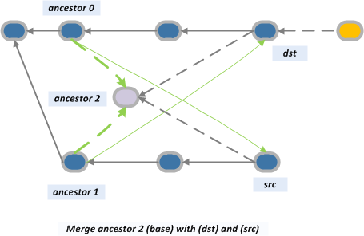

# Advanced merging strategies
Merging in Git is a tool which allows developed work in one branch to be merged back into the main line of development, or in general to merge work between two branches. There are several strategies for merging, which allow for different ways in which the algorithm will merge work across two branches. We cover some of the most popular merging strategies that come with Git.

## Contents
- [Strategies](#strategies)
    - [Fast forward](#fast-forward)
    - [No fast forward](#no-fast-forward)
    - [Recursive](#recursive)    
    - [Resolve](#resolve)
    - [Octopus](#octopus)
    - [Ours](#ours)
    - [Subtree](#subtree)
- [Sources](#sources)

## Strategies

### Fast Forward

```
git merge
```

Fast forward is the most default type of merging in git. It is used primarly when there are no new commits on the main branch so we can merge new commits linearly and move the HEAD pointer to the latest commit. The visualization bellow shows how the changes on the feature branch where linearly implemented to the develop (main) branch. 


### No Fast Forward

```
git merge --no-ff
```

Adding the --no-ff will seperate the last few commits on a seperate branch so we can clearly see the history in the branch structure as shown on the picture as well.

### Recursive

```
git merge -s recursive feature_branch main_branch
```

Recursive is the default merging strategy in Git when pulling or merging one branch. After branching and making some commits on the feature branch, there are typically some new commits on the main branch. Thus when branching, git recurses over the branch and creates a new merge commit, which will continue to have two parents. Git will also create a new ancestor commit if it cannot find any common ancestors.




### Resolve

### Octopus

### Ours

### Subtree

## Sources
List of sources used to obtain the information provided in this repository:
- https://www.atlassian.com/git/tutorials/using-branches/merge-strategy
- https://git-scm.com/docs/git-merge
- https://www.geeksforgeeks.org/merge-strategies-in-git/
- https://www.workingsoftware.dev/which-git-merge-strategy-is-appropriate-for-our-team/
- https://stackoverflow.com/questions/55998614/merge-made-by-recursive-strategy
