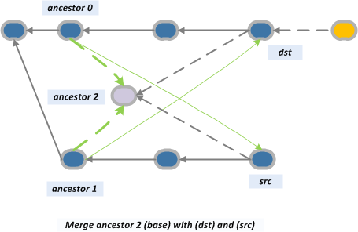

# Advanced merging strategies
Merging in Git is a tool which allows developed work in one branch to be merged back into the main line of development, or in general to merge work between two branches. There are several strategies for merging, which allow for different ways in which the algorithm will merge work across two branches. We cover some of the most popular merging strategies that come with Git.

:notebook_with_decorative_cover: ## Contents
- [Strategies](#strategies)
    - [Fast forward](#fast-forward)
    - [No fast forward](#no-fast-forward)
    - [Recursive](#recursive)    
    - [Subtree](#subtree)
    - [Resolve](#resolve)
    - [Octopus](#octopus)
    - [Ours](#ours)
- [Sources](#sources)

:hocho: ## Strategies

:black_circle: ### Fast Forward

```
git merge
```

Fast forward is the most default type of merging in Git. It is used primarly when there are no new commits on the main branch so we can merge new commits linearly and move the HEAD pointer to the latest commit. The visualization bellow shows how the changes on the feature branch where linearly implemented to the develop (main) branch. 


:black_circle: ### No Fast Forward

```
git merge --no-ff
```

Adding the --no-ff will seperate the last few commits on a seperate branch so we can clearly see the history in the branch structure as shown on the picture as well.

:black_circle: ### Recursive

```
git merge -s recursive feature_branch main_branch
```

Recursive is the default merging strategy in Git when pulling or merging one branch and it uses three-way algorithm to merge two branches. After branching and making some commits on the feature branch, there are typically some new commits on the main branch. Thus when branching, git recurses over the branch and creates a new merge commit, which will continue to have two parents. Git will also create a new ancestor commit if it cannot find any common ancestors.



:black_circle: ### Subtree

```
git merge -s subtree branch_A branch_B
```

Subtree is an extension of the recursive strategy when branch B is a child subtree of branch A. Firstly, the subtree strategy will update the changes of the tree structure of branch A, and then it will merge the changes just as the recursive strategy.

The subtree strategy is also often used when pulling subrepository changes to parent repository.

:black_circle: ### Resolve

```
git merge -s resolve feature_branch main_branch
```

Resolve strategy also uses three-way algorithm to merge two branches as does the recursive strategy. It looks for common commit ancestor of the two branches to base the merge on. Unlike recursive strategy, if it cannot find any common ancestor, it will choose one randomly rather then creating a new one. 

:black_circle: ### Octopus

```
git merge -s octopus branch_1 branch_2 ... branch_n
```

Octopus strategy is the default strategy when merging more than two branches, when for example more than one feature branches have been developed at once and need to be merged together. The advantage of this strategy is that it will create just one commit when merging rather than having multiple commits if the strategy would be to merge the branches one by one. 

:black_circle: ### Ours

```
git merge -s ours branch_1 branch_2 ... branch_n
```

This strategy is also used for merging multiple branches and it combines histories of the branches while only accepting changes made to the current HEAD. Changes made to other branches will be ignored. This is especially useful when one wants to merge old development branches with outdated code and create a new common ancestor for easier merging in the future.

:information_source: ## Sources
List of sources used to obtain the information provided in this repository:
- https://www.atlassian.com/git/tutorials/using-branches/merge-strategy
- https://git-scm.com/docs/git-merge
- https://www.geeksforgeeks.org/merge-strategies-in-git/
- https://www.workingsoftware.dev/which-git-merge-strategy-is-appropriate-for-our-team/
- https://stackoverflow.com/questions/55998614/merge-made-by-recursive-strategy
- https://docs.github.com/en/get-started/using-git/about-git-subtree-merges
